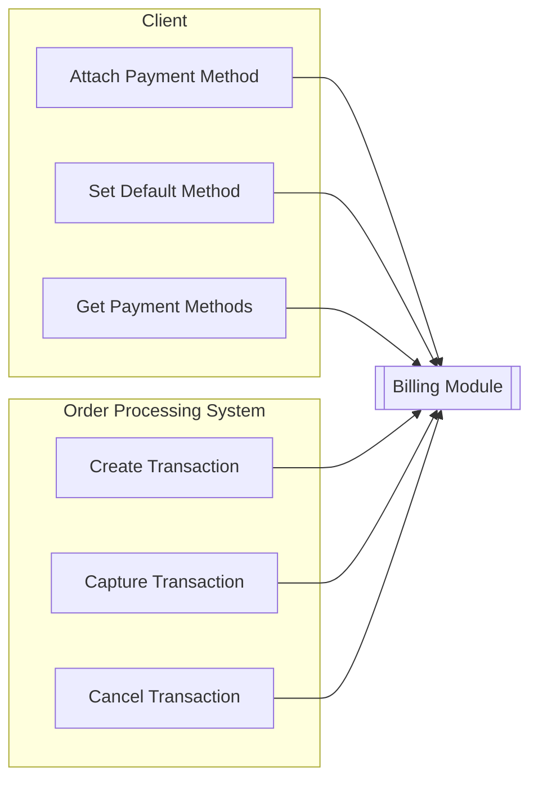

- <b style="color: blue">#temporal</b>
- <b style="color: blue">#distributed_transactions</b>
- <b style="color: blue">#orchestration</b>

# Temporal: Deep Dive. От требований до workflow: проектируем биллинг с оркестрацией (Часть 1 — анализ требований)

В этой статье мы отойдём от абстрактной теории и наконец-то займемся чем-то интересным. Вместо обсуждения надуманных примеров, мы возьмём вполне реалистичную задачу для огромного количества (не финтех) компаний — обработку платёжных транзакций. Вместе мы попробуем пройти весь путь: от первых продуктовых обсуждений до готовой системы, часть которой реализована с помощью Temporal Workflow.

Мы начнём с того, что трансформируем неструктурированные хотелки в формализованные требования: функциональные, нефункциональные и бизнес-правила. Затем мы разберёмся с особенностями интеграции с платёжным шлюзом и ограничениями, которые она накладывает.

После этого — обсудим архитектурные решения, объясним, почему для оркестрации мы выбрали именно Temporal, и, наконец, покажем, как перейти от идей и диаграмм к коду — включая тестирование, наблюдаемость и поддержку изменений.

Готовы? Поехали!

> [!NOTE]
> Эта статья — часть цикла статей про Temporal. Мы увидим, как Temporal органично вписывается в реальную систему, а не просто изучим его API. Чтобы сохранить фокус, я сознательно **упрощаю многие этапы**: я не буду глубоко уходить в requirements engineering, проектировать каждый компонент до каждой гайки или покрывать все корнер кейсы. Это всё-таки обучающая статья, а не реальный дизайн production-ready системы.

## Контекст задачи

Давайте начнём с ответа на вопрос "а что же мы будем делать". Представим ситуацию, что мы, как компания Х, продающая свои услуги клиентам, хотим разработать собственный модуль биллинга для того, чтобы иметь возможность проводить оплаты через наш сервис. Тут я не хотел бы изобретать велосипед и выдумывать абстрактного коня, поэтому за основу возьму наш реальный опыт (по части требований и клиентского flow, но с существенным упрощением) из нашего домена: компания, которая строит сервис заказа такси.

Свой процессинг мы писать не хотим (мы ведь не финтех), поэтому приняли решение интегрироваться с существующим payment gateway, который позволит нам проводить списания по карточкам пользователей. Помимо этого, бизнес хочет получить некоторый observability в том, что происходит в биллинге — как в продуктовом, так и в техническом срезе. Что имеется в виду:

- продуктовые стейкхолдеры (аналитики с продактами) хотят иметь возможность анализировать транзакции пользователей, их типы, бизнес-коды и т. д.;
- технические стейкхолдеры (да и продуктовые тоже) хотят отслеживать состояние системы в рантайме и получать уведомления о том, что что-то идёт не так: рост отказов по платежам, деградация производительности, рост latency между переходами состояний и прочее.

**Итого:**

Нужно разработать подсистему (или модуль) биллинга, которая позволяла бы пользователям управлять платежными методами, проводить по ним списания, а так же хранить локальный снепшот данных (для анализа), включая:

- информацию по платёжным методам
- информацию по платёжным транзакциям

## Изучаем требования

Теперь, имея на руках контекст, мы можем внимательно подумать над тем, из чего должна состоять система и как она должна функционировать. Сразу задаёмся вопросом: _а с чего же начать_?

Дело в том, что перед тем, как рисовать красивые кружочки и квадратики, необходимо проанализировать требования и понять, как система должна работать (с точки зрения бизнеса).

На самом деле, это один из ключевых этапов, ведь неверно собранные или проанализированные требования могут привести к тому, что все решение придется выбросить и разработать заново (в худшем случае), либо же дальнейшая его разработка станет крайне сложной и непредсказуемой (по ETA, багам, etc)

### Требования: первичный сбор

Прежде чем погружаться в реализацию, стоит ответить на ключевой вопрос: **а что именно должна делать система**?

Вместе с этим всплывают и другие важные вопросы: какие сценарии поддерживаются, какие ограничения есть у бизнес-домена, и какие внешние сигналы должны запускать процессы. Ниже описаны группы основных вопросов, которые возникают в голове, когда мы смотрим на первичную постановку

**Клиентский путь**

- Когда выполняется привязка карты?
  - Перед заказом?
  - До регистрации?
- Когда бизнес хочет проводить списание?
  - До оказания услуги?
  - После?
  - Поэтапно (частями)?
- Планирует ли бизнес каким-либо особым образом минимизировать риски при оказании услуг?

**Сценарии отказа и возвратов**

- Обязаны ли мы в каких-то исключительных ситуациях возвращать средства? Частично или полностью?
- Что делать, если клиент отказался от поездки до её завершения? Например,
  - Если автомобиль ещё не прибыл к клиенту?
  - Если автомобиль прибыл к клиенту и ожидает его?
  - Если поездка уже началась?

**Поведение при ошибках**

- Что делать при отказе платежа?
  - Показываем ошибку?
  - Предлагаем другой метод?
- Разрешено ли клиенту выбрать другую карту при fail-е первой попытки?
- Поддерживаются ли fallback-механизмы (например, на другие привязанные клиентом карточки)?

**Обязательства перед клиентом**

- Какие данные должны отображаться в истории транзакций?
- Какие статусы важны для клиента: оплачено, в обработке, отменено, возвращено?
- Нужно ли отправлять пользователю чек или уведомление о транзакции?

**Финансовые и продуктовые ограничения**

- Есть ли лимиты на минимальные/максимальные суммы транзакций?
- Какие типы транзакций поддерживаются: списание, возврат, отмена, комиссия?

С этими вопросами мы идем к продакту и получаем нужные нам ответы. Для краткости пример диалога вынесен в collapse секцию, но я **настоятельно** рекомендую с ним ознакомиться.

  <b>Пример диалога с продактом: обсуждаем, как должен работать биллинг</b>

...

— (Арх) Слушай, начнём с простого: когда клиент вообще впервые сталкивается с оплатой? У нас есть какие-то сценарии, где он привязывает карту до регистрации? Или всё-таки уже после?

— (Продакт) Да нет, до регистрации точно не надо. Пусть сначала зайдёт, разберётся, кто мы такие. Привязка карты — уже после регистрации. И мы не ограничиваем — можно хоть десять карт прикрутить, если душа просит.

— А система как-то понимает, какая карта из них основная?

— Конечно. Клиент сам может выбрать, какая у него будет "дефолтной". И мы по умолчанию будем использовать её — для всего: и для поездки, и если он вдруг решит оставить чаевые или за платное ожидание заплатить.

— Хм, а что насчет удаления? Должны ли мы предоставлять возможность пользователю удалить ранее добавленную карту?

— Конечно. Клиент может удалить карту в любой момент.

— Но погоди, а если у клиента есть активные поездки, по которым висят запущенные транзакции в ожидании? Если он удалит карту, то могут возникнуть проблемы с дальшейшим подтверждением этих транзакций! Поездка будет выполнена, но списания не произойдет. Фактически, мы сознательно закладываем способ фрода в систему??

— А это хорошее замечание! Нет, конечно, такого быть не должно. Компания не намерена терять деньги, поэтому мы не должны позволять удалять карту, если есть какие-то незавершенные транзакции.

— Окей, а вот момент истины: когда мы списываем деньги? До поездки, после? Или может быть как-нибудь в два этапа?

— Тут тонкий момент. Мы боимся, что кто-то будет просто "поиграться" — типа «закажу, а потом отменю». Поэтому мы хотим до начала поиска машины сделать авторизацию — заблокировать сумму на карте. Без фактического списания.

— То есть мы сначала делаем холд, и только если всё ок — начинаем поиск машины?

— Именно. Это такая гарантия, что клиент — серьёзный. Если банк сказал "авторизовано", мы начинаем искать. Если нет — ну извините.

— А списание? Всегда полная сумма или есть нюансы?

— В основном — полная. Но бывает, что после поездки клиент сам добавляет чаевые или было платное ожидание — тогда можем добрать чуть больше. Ну и если заказ отменяется, это тоже влияет.

— Ага. А если клиент передумал? Например, заказал машину, но пока она ехала — передумал.

— Мы это делим на ситуации. Если он отменил до того, как машина выехала — всё ок, не списываем. Но если машина уже приехала — списываем всю сумму. И особенно если она уже начала поездку — там вообще без разговоров. Хотя, конечно, можем вручную посмотреть кейс, если клиент пожалуется.

— А у нас есть вообще где-то список всех этих транзакций, которые клиент может посмотреть? История платежей, статусы, вот это всё?

— Пока нет. Всё, что связано с деньгами, будет просто отображаться в деталях поездки — типа "стоимость такая-то", "добавлены чаевые", "была отмена". Поэтому отдельный раздел с транзакциями или статусами делать не будем. Хотя, возможно, в будущем добавим.

— А чеки?

— Аналогично. Сейчас не нужны, но может появятся требования позже — тогда добавим.

— А что если авторизация не прошла? Мы как-то сами пробуем другую карту? Или клиент должен сам разруливать?

— Тут мы не хотим "магии". Никаких автоматических переключений. Не прошла — покажем ошибку, предложим выбрать другую карту. Всё под контролем пользователя.

— Как будем об этом сообщать?

— Двумя путями. Во-первых, прямо в интерфейсе: у нас там спиннер крутится — клиент должен понять, что пошло не так. Во-вторых — пуш или смс. Особенно если он уже ушёл из приложения или заблокировал экран.

— То есть весь этот этап: и авторизация, и поиск машины — это такой "pre-processing"?

— Да, именно. Клиент видит один и тот же экран. И для него всё это — как будто один шаг. Он не должен вникать, что сначала мы банк спрашиваем, потом машину ищем. Он просто видит "поиск машины".

— А если авторизация прошла, но машину найти не удалось?

— Вот тут важный нюанс. Если средства заморожены, но машину не нашли, надо как можно быстрее их разморозить. Иначе будет плохо — потому что:

- Visa размораживает через 7 дней
- Mastercard — через 5

— Ухх. То есть деньги просто "висят" всё это время?

— Да. А клиенты пишут в саппорт, спрашивают, почему сняли и не вернули. Хотя мы ничего не снимали. Поэтому хотим делать активный расхолд, если поездка не состоялась.

— Слушай, а у нас есть какие-то ограничения по времени? Типа — сколько времени в среднем проходит до того, как клиенту уже назначают машину?

— Да. Мы это тщательно трекаем. У нас p90 — это 3 секунды. p99 — 5 секунд. Очень хорошие цифры, кстати. Одни из лучших на рынке. И мы не хотим их портить из-за медленного платежного шлюза или подвисаний на авторизации. Чем быстрее работает система — тем выше конверсия. Мы это на экспериментах проверяли. Даже 2–3 секунды задержки могут повлиять на решение остаться или уйти.

...

 

> [!NOTE]
> На самом деле, существует ещё огромное количество вопросов, которое можно было бы обсудить в рамках нашего диалога с продактом, но для формирования ядра этого вполне достаточно. При этом, по мере реализации некоторые из них так или иначе будут всплывать, поэтому постараемся найти на них ответы в процессе анализа. Другие же, скорее всего, опустим для упрощения.

### Требования: формализация и актуализация

Итак, мы получили достаточно подробный продуктовый контекст и прояснили множество деталей. Теперь необходимо зафиксировать требования и правила, которые повлияют на проектирование. Это **важный этап**: формализация требований не только помогает команде проектировать решение осознанно, но и создаёт базу для валидации, тестирования, формирования документации и оценки покрытия системой потребностей бизнеса.

Кстати, стоит **отдельно отметить**: в диалоге с продактом часть озвученных требований касалась непосредственно биллинга, другая — соседних систем (например, модуля обработки заказов). Это довольно важный момент. На этапе анализа требований нужно уметь **отделять релевантные детали от нерелевантных**: отбрасывать то, что не входит в зону нашей ответственности, и в то же время замечать требования, которые могут **косвенно повлиять на поведение системы** — даже если напрямую к ней не относятся. Вот несколько характерных примеров:

- Требование "авторизовать средства перед поиском автомобиля" напрямую влияет на **архитектуру биллинга**, поскольку он должен уметь обрабатывать такие запросы и уведомлять о результатах.
- Визуализация ошибки в UI, отправка уведомлений и предложение сменить карту — это **не задача биллинга напрямую**, но биллинг должен уметь **сигнализировать** о проблемах с авторизацией, чтобы система (например, та часть, что отвечает за процессинг заказа) могла корректно среагировать на подобные проблемы.

В индустрии существует целая дисциплина под названием `requirements engineering` — она включает в себя сбор, анализ, документирование и сопровождение требований. Существует множество моделей, включая `RAM`, `Volere`, `Use Case-Driven Model` и другие — каждая со своими принципами и применимостью. Но на практике, особенно в условиях старта нового проекта или разработки MVP, важно не следовать формальностям, а сделать требования понятными, проверяемыми и поддерживаемыми.

Сами по себе списки требований полезны, но не всегда достаточны. Хорошую поддержку аналитике и архитектуре оказывают также и другие артефакты:

- use case map — помогает визуализировать, кто что делает в системе
- activity diagram — упрощённые блок-схемы процессов, полезные для согласования шагов
- концептуальные и логические модели данных — фиксируют ключевые сущности и их связи
- матрицы и деревья решений — применимы, когда поведение зависит от множества условий

В этой статье мы не будем слишком сильно углубляться в детализацию требований, а ограничимся двумя шагами:

- опишем use case map — чтобы зафиксировать ключевые сценарии
- составим каталог требований, сгруппированных по **functional capabilities**

  <b>Что такое Functional capabilities?</b>

**Functional capabilities** — это ключевые функциональные блоки системы, описывающие, **что она должна уметь делать** с точки зрения пользователя, бизнес-процесса или взаимодействия с другими системами. Иначе говоря, это «умения» или «роли», которые система исполняет. Каждый capability отвечает на вопрос:

> _"Что полезного может делать система в этом контексте?"_

Например:

- `PAYMENT_METHODS` — всё, что касается управления платёжными методами клиента: привязка, выбор по умолчанию, замена при ошибке.
- `PAYMENT_TRANSACTIONS` — обработка транзакций: авторизация, списание, отмена, возврат.
- В будущем могут появиться и другие, например: `REFUNDS`, `RECEIPTS` — в зависимости от эволюции продукта.

С группировкой требований по functional capabilities становится легче:

- отслеживать зоны ответственности
- делегировать задачи между командами
- расширять и масштабировать систему по частям

#### Use Case Map

Давайте начнём с самого очевидного — что вообще должно происходить в системе и кто этим управляет. Это простое, но критически важное упражнение: фиксируя ключевые сценарии использования, мы не только понимаем, как устроена жизнь внутри системы, но и получаем отправную точку для дальнейшего проектирования.

Такая карта помогает:

- определить зоны ответственности между участниками
- заложить основу для API-контрактов и архитектурной декомпозиции
- обеспечить трассировку требований в проектировании

Причём это полезно не только архитекторам, но и продуктовым, и инженерным командам — она помогает согласовать ожидания, прояснить роли и очертить границы системы.

**Каталог акторов**

На этом этапе мы чётко видим двух основных участников:

- Клиент (client) — пользователь, который управляет своими платёжными методами.
- Система обработки заказов (ordering system) — backend-процесс, инициирующий транзакции и управляющий их жизненным циклом в рамках выполнения заказа.

**Каталог юзкейсов**

Ниже описан каталог базовых юзкейсов (тех, которые видны на текущем этапе). Я сразу описал, к какой functional capability группе относится каждый юзкейс.

| Use Case                     | Capability             | Initiator        | Description                                                |
| ---------------------------- | ---------------------- | ---------------- | ---------------------------------------------------------- |
| `Create Payment Method`      | `PAYMENT_METHODS`      | Client           | Привязка нового платёжного метода                          |
| `Set Default Payment Method` | `PAYMENT_METHODS`      | Client           | Установка платёжного метода по умолчанию                   |
| `Get Payment Methods`        | `PAYMENT_METHODS`      | Client           | Получение списка всех доступных платёжных методов          |
| `Create Transaction`         | `PAYMENT_TRANSACTIONS` | Order Processing | Предварительная авторизация средств перед оказанием услуги |
| `Capture Transaction`        | `PAYMENT_TRANSACTIONS` | Order Processing | Финальное списание средств по авторизации                  |
| `Cancel Transaction`         | `PAYMENT_TRANSACTIONS` | Order Processing | Отмена замороженной суммы, если услуга не была оказана     |

> [!NOTE]
> Данный каталог не претендует на исчерпывающий список. По мере развития требований, use case’ов может стать больше: например, могут появиться процессы по возвратам или отправке чеков. Однако на старте важно зафиксировать именно те сценарии, которые влияют на начальное проектирование архитектуры и контракты между компонентами.

И давайте её визуализируем

> к сожалению, markdown не поддерживает честный UML, поэтому воспользуюсь mermaid flowchart

#### Requirements Catalog

Теперь, когда мы изучили основные продуктовые сценарии использования системы, можно перейти к следующему шагу — детализации требований. Мы сформируем два отдельных каталога:

- Каталог бизнес-правил — фиксирует организационные, юридические и продуктовые константы, не привязанные к конкретной реализации
- Каталог функциональных требований — отвечает на вопрос "что именно должна уметь делать система?" в терминах поведения, функций и возможностей

Разделение этих каталогов важно. Бизнес-правила помогают выделить ключевые факты, применимые в разных системах и процессах. Они не изменяются вместе с кодом, и часто влияют на десятки требований. Функциональные требования, напротив, описывают конкретную реализацию и API.

#### Requirements Catalog: бизнес-правила (Business Rules)

Каталог бизнес-правил (BR) полезен тем, что позволяет явно отделить доменные правила от логики системы, и сделать их повторно используемыми при анализе других требований. Это позволит нам не упустить важные детали.

- BR.TRANSACTION_TYPES.1 — В системе должны поддерживаться следующие типы транзакций: авторизация, списание, отмена авторизации.
- BR.TRANSACTION_TYPES.2 — Каждая транзакция должна сопровождаться метаданными: бизнес-код (тип транзакции), инициатор (клиент, от имени которого она совершается).

#### Requirements Catalog: функциональные требования (Functional Requirements)

Перед тем как зафиксировать функциональные требования, важно изучить особенности и ограничения той системы, с которой будет интеграция — в нашем случае это Stripe. Выбор конкретного платёжного шлюза в реальности может сопровождаться полноценным анализом альтернатив, оценкой рисков и соответствием требованиям. Однако в рамках этой статьи мы предполагаем, что такой анализ уже был проведён, и решение использовать Stripe было утверждено.

> [!WARNING]
> Иногда выбор происходит иначе: команда уже знакома с инструментом, быстро проверяет его на совместимость с требованиями, получает одобрение бизнеса — и едет дальше. Такой «снизу-вверх» подход (основанный на prior knowledge + fast track) вполне жизнеспособен, хотя и требует осознанности в управлении рисками и архитектурными последствиями.

**Исследование Stripe: влияние на архитектуру**

Stripe предоставляет SDK (в том числе для .NET) и довольно подробную [документацию](https://stripe.com/docs/api). Мы убедились, что он поддерживает необходимую нам модель authorize → capture. Настройка SDK на бэкенде сводится к инициализации с API Key, который нужно безопасно хранить и использовать.

Однако взаимодействие с платежами требует наличия **двух критически важных параметров**, без которых дальнейшая работа невозможна:

- `customerId` — идентификатор пользователя в Stripe
- `paymentMethodId` — идентификатор платёжного метода, привязанного к пользователю

А это означает, что в системе должен быть реализован процесс, состоящий из двух этапов (шагов):

- мы должны сначала создать пользователя (Customer) в Stripe
- только затем — разрешить пользователю привязать платёжный метод

> Важно: нельзя создать `PaymentMethod`, если `Customer` ещё не существует. Порядок критичен и должен быть строго соблюдён.

Процесс создания платёжного метода в Stripe **двухэтапный**:

1. **Создание Setup Intent и Ephemeral Key** — это делается на стороне бэкенда
2. **Завершение привязки на клиенте** — мобильное или веб-приложение использует SDK Stripe, чтобы безопасно завершить процесс с участием пользователя

То есть мы приходим к пониманию того, что Stripe не просто задаёт формат API — он формирует структуру взаимодействия между фронтом и бэкендом, а также накладывает жёсткие ограничения на порядок операций и обязанности сторон. Ключевые особенности, которые влияют на архитектуру:

- Привязка платёжного метода невозможна без Customer
- Привязка требует участия клиента — завершение происходит только через клиентский SDK, на сервере этот процесс не эмулируется
- Backend ответственен за контроль и хранение: он создаёт Intent, валидирует результат и сохраняет paymentMethodId после завершения привязки
- Переиспользование методов возможно только после успешной привязки — важно корректно завершить flow на фронте и убедиться в результате

Эти ограничения нельзя обойти, и они напрямую определяют архитектуру API, распределение ответственности и сценарии отказа. Для лучшего понимания концепции, ниже приведены ссылки на официальную документацию Stripe по ключевым понятиям:

- [How PaymentIntents work](https://docs.stripe.com/payments/paymentintents/lifecycle)
- [Place a hold on a payment method](https://docs.stripe.com/payments/place-a-hold-on-a-payment-method)
- [Save a customer's payment method without making a payment](https://docs.stripe.com/payments/save-and-reuse)

**Формирование каталога требований**

Все вышеописанные ограничения определяют функциональные возможности, которые должна реализовать система. Перейдём к формализации этих требований по capability-группам. Эти требования описывают, что система должна уметь делать с точки зрения пользователя или другой системы.

📦 **Functional Capability: ACCOUNTS**

- `ACCOUNTS` — Система должна обеспечивать управление учётными записями в рамках биллингового контура.
- `ACCOUNTS.CREATION` — Система должна предоставлять возможность создания новой учётной записи.
- `ACCOUNTS.DELETION` — Система должна предоставлять возможность удаления учётной записи при соблюдении установленных условий и требований безопасности.

📦 **Functional Capability: PAYMENT_METHODS**

Система должна реализовывать возможность управление платёжными методами, включая добавление, удаление, просмотр и установку метода по умолчанию

- `PAYMENT_METHODS.CREATE` — Система должна позволять клиенту добавлять новый платёжный метод.
- `PAYMENT_METHODS.DELETE` — Система должна позволять клиенту удалять платёжный метод.
  - `PAYMENT_METHODS.DELETE.VALIDATIONS.PENDING_TRANSACTIONS` — Система должна запрещать удаление метода при наличии незавершённых транзакций.
- `PAYMENT_METHODS.GET_ALL` — Система должна позволять клиенту получить список всех его платежных методов.
- `PAYMENT_METHODS.MAKE_DEFAULT` — Система должна позволять клиенту установить метод по умолчанию для будущих транзакций.

📦 **Functional Capability: TRANSACTIONS**

Система должна позволять другим системам выполнять проведение транзакций по клиентской учётной записи.

- `TRANSACTIONS.TYPES` — Система должна поддерживать типы транзакций, указанные в BR.TRANSACTION_TYPES.1.
- `TRANSACTIONS.AUTHORIZE` — Система должна позволять предварительно авторизовать оплату с удержанием средств.
  - `TRANSACTIONS.AUTHORIZE.CANCEL` — Система должна поддерживать отмену ранее авторизованной транзакции до списания.
  - `TRANSACTIONS.AUTHORIZE.CAPTURE` — Система должна поддерживать списание средств по авторизованной сумме.
    - `TRANSACTIONS.AUTHORIZE.CAPTURE.1` — Система должна поддерживать полное списание средств по авторизованной сумме.
    - `TRANSACTIONS.AUTHORIZE.CAPTURE.2` — Система должна поддерживать частичное списание средств по авторизованной сумме.

📦 **Functional Capability: INTEGRATIONS.STRIPE**

Система должна реализовывать интеграцию с платёжной платформой Stripe для обработки транзакций и платежных методов.

- `INTEGRATIONS.STRIPE` — Система должна интегрироваться с платёжной платформой Stripe для обработки транзакций и методов.
- `INTEGRATIONS.STRIPE.WEBHOOKS` — Система должна обрабатывать Stripe вебхуки в реальном времени.
- `INTEGRATIONS.STRIPE.WEBHOOKS.CUSTOMER_CREATED` — Система должна корректно обрабатывать событие создания клиента в Stripe.
- `INTEGRATIONS.STRIPE.WEBHOOKS.SETUP_INTENT_SUCCEEDED` — Система должна обрабатывать успешное завершение Setup Intent.

### Требования: промежуточный итог

На этом этапе у нас есть достаточно информации, чтобы зафиксировать первые архитектурно значимые выводы. Эти выводы не являются исчерпывающим набором требований, но уже задают вектор — они очерчивают архитектурные границы, подсказывают, какие контракты нужно будет согласовать, и на что стоит опираться при проектировании.

- Платёжные методы — система должна позволять клиенту управлять платёжными методами: добавлять, выбирать, переиспользовать. Это отдельная capability, но тесно связанная с транзакциями.
- Двухфазная модель платежей — сначала авторизация, затем списание. При отмене заказа — расхолд. При успешной услуге — захват средств.
- Идемпотентность и надёжность — все операции (авторизация, списание, отмена) должны быть устойчивы к повторениям, сбоям и гонкам. Это влияет как на API, так и на внутреннюю реализацию.
- SLO критичен — "pre-processing" (авторизация перед поиском машины) должен укладываться в SLO поиска (до 5 секунд). Это накладывает жёсткие требования на скорость и поведение биллинга.
- UX и реакция на ошибки — в случае неудачной авторизации система должна быстро уведомить клиента, чтобы он мог сменить карту. Это влияет как на оркестрацию, так и на контракты с клиентским UI.
- Храним историю — все транзакции и ошибки нужно сохранять, но без обязательства показывать их в клиентском интерфейсе. Это требование важно для аналитики и поддержки.

Итак, мы сформировали какой-то пул требований и описали, что должна уметь делать наша система. Но даже при такой хорошей проработке функциональных требований остаётся **один важный пробел**...

Дело в том, что до этого мы сосредоточились на _что система должна делать_, но не поговорили о том, _как хорошо_ она должна это делать. Настало время затронуть **нефункциональные требования (NFR)**: производительность, надёжность, отказоустойчивость, безопасность и другие атрибуты качества, без которых невозможно качественно проектировать систему.

### Требования: определяем атрибуты качества (NFR/Quality Attributes)

Когда говорят о требованиях, чаще всего обсуждают именно функциональные — что система должна уметь делать. Но это лишь половина картины. Во многих случаях именно нефункциональные требования (или атрибуты качества) определяют, насколько система действительно пригодна для использования в реальном мире.

Ведь именно NFR-ы определяют:

- насколько она будет отзывчивой
- выдержит ли система продакшен-нагрузку
- как она поведёт себя при сбоях
- как быстро разработчики смогут понять, что происходит при ошибке
- насколько прозрачно и удобно продуктовой команде будет работать с данными

> [!WARNING]
> На практике большинство production-проблем возникают не из-за багов в логике, а из-за того, что во время проектирования игнорируются нефункциональные аспекты — задержки, таймауты, сбои интеграций, непрозрачность логирования, отсутствие метрик или деградация под нагрузкой.
>
> Именно поэтому, даже если система кажется простой — важно заранее обсудить, **какие атрибуты качества она должена обеспечивать**.

Когда говорят о нефункциональных требованиях, важно понимать — это не один параметр вроде "быстро работает". Это целый спектр атрибутов качества, которые описывают как система должна себя вести в продакшене.

Среди них:

- Производительность и SLO — как быстро должна работать система и какие задержки допустимы.
- Надёжность — что делать при сбоях, как восстанавливаться.
- Безопасность — кто и как может выполнять операции, как защищаются данные.
- Наблюдаемость (Observability) — как понять, что происходит внутри: логи, метрики, алерты.
- Поддерживаемость — насколько легко отлаживать, развивать, масштабировать.

Конечно, те группы, что я упомянул выше — лишь верхушка айсберга. На практике к нефункциональным требованиям относят гораздо больше аспектов: от особенностей развертывания и локализации до ограничений по доступности, юридическим требованиям, требованиям к отчётности и многому другому.

Важно понимать: недостаточно просто заявить "система должна быть быстрой и надёжной" — нужно уметь это проверять, наблюдать, контролировать и замерять.

Эта тема довольно обширная, и в рамках одной статьи её полностью не охватить. Поэтому сейчас мы сфокусируемся на одном из самых чувствительных аспектов для нашего случая — **устойчивости и корректности интеграций со сторонними системами**, таким как платёжный шлюз Stripe.

#### Анализируем требования к интеграции

Перед формированием полного списка нефункциональных требований, мы решили внимательно изучить **специфику** работы Stripe. В процессе изучения мы столкнулись с рядом особенностей, которые напрямую влияют на архитектуру и корректность интеграции:

- Stripe требует использования `idempotency_key` при вызове большинства операций: без него повторный запрос может создать дубликат (например, повторное списание).
- Ошибки уровня 5xx не всегда означают, что операция завершилась с ошибкой. Stripe прямо говорит, что после таких ошибок нужно **восстанавливать контекст** — либо через `GET`-запрос, либо через webhook. Это не всегда удобно.
- В ответах от Stripe присутствуют различные **бизнесовые коды ошибок**, например `insufficient_funds`, `card_declined`, `do_not_honor`. Некоторые из них предполагают разную реакцию от системы и даже от UI.
- Наконец, API может возвращать промежуточные статусы (например, `requires_action`), и система должна правильно с ними обращаться — это не просто "успех/ошибка".

> [!NOTE]
> Интеграции с внешними системами — это не просто про "написать обёртку". От того, как система реагирует на нестандартные ошибки, зависит корректность финансовых операций и доверие клиентов. Поэтому даже простые вещи вроде "что делать при 500" стоит явно проговорить с командой продукта.

Чтобы понять, как бизнес хочет реагировать на эти случаи, мы обсудили их с продактом.

  <b>Диалог с продактом: обсуждаем реакцию в корнер-кейсах Stripe</b>

...

— (Архитектор) Слушай, мы изучили API Stripe и заметили, что у них довольно необычно устроена обработка ошибок. Например, 500-ая ошибка может означать как реальный сбой, так и ситуацию, когда мы не знаем — был ли платёж успешным или нет. Что в таком случае делаем?

— (Продакт) Пока всё просто: считаем транзакцию неуспешной, уведомляем пользователя и отправляем алерт в SLOck — чтобы команда руками посмотрела, что произошло.

— То есть автоматического восстановления пока не делаем? Например, не пробуем потом запросить статус через API?

— Нет. Мы об этом думали, но сейчас не хотим усложнять систему. Возможно, добавим автоматическую реконсиляцию позже, когда появится команда, которая будет её поддерживать. Сейчас достаточно ручного мониторинга.

— Окей. А что насчёт ошибок от Stripe, которые не технические, а бизнесовые? Например, `insufficient_funds` или `card_declined`?

— Да, хорошее замечание. Мы как раз хотим различать эти кейсы. Если недостаточно средств — это одна история, нужно сообщить пользователю об этом прямо ("недостаточно средств на карте"), а не что-то абстрактное вроде "обратитесь в банк".

— А сами ошибки мы храним? В смысле, бизнес-код, оригинальное сообщение от Stripe и т.д.?

— Да. Хотим сохранить как **raw ответ**, так и нормализованный бизнес-код. Это потом можно будет использовать и в аналитике, и для пользовательских сообщений. Причём желательно, чтобы UI уже получал нормализованный код, а не парсил сам.

— Принято. То есть, грубо говоря, мы оборачиваем Stripe-ошибки в наши доменные типы ошибок и прикладываем оригинальный payload, если надо?

— Именно так. Причём, если это критичная ошибка — хотим ещё и сигнал в observability, чтобы можно было быстро отреагировать.

...

В результате анализа мы можем сформировать следующий список NFR, которые относятся к интеграции с внешним платежным шлюзом (Stripe)

**Reliability**

- `NFR.STRIPE.FAILURE.1` — Система должна трактовать ошибки **5xx от Stripe** как неопределённые, завершать транзакцию с ошибкой и отправлять **alert на ручную проверку**.
- `NFR.STRIPE.FAILURE.2` — При получении **429 (rate limit)** система должна выполнять **экспоненциальные повторные попытки** с ограничением по времени.
- `NFR.STRIPE.FAILURE.3` — При получении **ошибок с бизнес-смыслом** (например, `insufficient_funds`, `card_declined`) система должна обеспечивать возможность отображения **понятного сообщения пользователю**.

**Observability**

- `NFR.STRIPE.OBS.1` — Все ошибки от Stripe должны логироваться с деталями: `code`, `type`, raw payload, связанный `transactionId`, `userId` и др.
- `NFR.STRIPE.OBS.2` — При отказе платежа должна генерироваться бизнес-событие `PaymentFailed`, содержащее нормализованный тип ошибки и оригинальный ответ от Stripe.

**Idempotency**

- `NFR.STRIPE.IDEMPOTENCY.1` — Все запросы к Stripe должны быть **идемпотентными**, с ключами, уникальными для бизнес-операции (например, `authorize-{transactionId}`).
- `NFR.STRIPE.IDEMPOTENCY.2` — Идемпотентные ключи должны быть **воспроизводимыми** и формироваться заранее, чтобы при повторных попытках не происходило дублирования операций.

#### Анализируем общие нефункциональные требования

До этого момента мы сосредоточились на Stripe и его особенностях как внешней системы. Однако, чтобы сформировать полноценное представление о требованиях к нашей архитектуре, важно взглянуть шире — на все нефункциональные требования, применимые к модулю биллинга.

Такие требования обычно задаются не одной системой, а вырастают из сочетания продуктовых ожиданий, внутренних инженерных практик, стандартов безопасности и политики организации. Это могут быть правила авторизации, политики API-групп, ожидания по логированию и наблюдаемости, требования к производительности и масштабируемости.

Ниже приведён каталог нефункциональных требований, который мы будем использовать как ориентир при проектировании архитектуры. Каталог покрывает ключевые аспекты: надёжность, безопасность, идемпотентность, SLO, наблюдаемость и поддержку внешних и внутренних API.

На основе наших внутренних политик, коммуникаций с бизнесом и инженерами, мы можем выделить такой набор NFR

**Reliability**

- `NFR.STRIPE.FAILURE.1` — Система должна трактовать ошибки 5xx от Stripe как неопределённые, завершать транзакцию с ошибкой и отправлять alert на ручную проверку.
- `NFR.STRIPE.FAILURE.2` — Система должна выполнять экспоненциальные повторные попытки с ограничением по времени при получении ошибки 429 (rate limit).
- `NFR.API.RESILIENCE.1` — Система должна обеспечивать механизмы ретраев и таймаутов при взаимодействии с внешними системами, управляемые конфигурацией.

**Observability**

- `NFR.METRICS.1` — Система должна собирать метрики внешних вызовов: количество, длительность, ошибки, ретраи.
- `NFR.METRICS.2` — Система должна эмитить метрики переходов между состояниями, включая тайминги и количество попыток.
- `NFR.STRIPE.OBS.1` — Система должна логировать все ошибки от Stripe с деталями: код, тип, исходный payload, идентификаторы транзакции и пользователя.

**Idempotency**

- `NFR.API.IDEMPOTENCY.1` — Система должна обеспечивать идемпотентность всех внутренних API ручек, связанных с созданием, списанием и отменой транзакций.
- `NFR.STRIPE.IDEMPOTENCY.1` — Система должна отправлять идемпотентные запросы к Stripe с уникальным ключом на каждую бизнес-операцию.
- `NFR.STRIPE.IDEMPOTENCY.2` — Система должна формировать идемпотентные ключи детерминированно, чтобы обеспечить воспроизводимость при повторных вызовах.

**Security**

- `NFR.API.AUTH.1` — Система должна защищать все API через JWT-авторизацию.
- `NFR.API.AUTH.2` — Система должна проверять наличие скопов доступа к API-группам (`apigroup.public`, `apigroup.private`, `apigroup.system`) в JWT.
- `NFR.API.AUTH.3` — Система должна проверять в JWT наличие скопов, определяющих доступ к конкретным операциям (например, `billing.transactions.create`).
- `NFR.API.SECURITY.1` — Система должна применять авторизацию как на уровне API Gateway, так и внутри сервисов.
- `NFR.API.SECURITY.2` — Система должна маскировать чувствительные данные при логировании и трассировке.

**Performance**

- `NFR.API.LATENCY.1` — Система должна обеспечивать end-to-end время обработки запроса на авторизацию транзакции не выше p99 ≤ 5 секунд.
- `NFR.API.THROUGHPUT.1` — Система должна выдерживать следующие нагрузки:
  - `NFR.API.THROUGHPUT.1.1` — до 25 транзакций в минуту при стандартной нагрузке;
  - `NFR.API.THROUGHPUT.1.2` — до 150 TPM при нагрузочных всплесках.

**Maintainability & Auditability**

- `NFR.AUDIT.1` — Система должна сохранять аудит-записи всех ключевых шагов в обработке транзакции.
- `NFR.AUDIT.2` — Система должна логировать ошибки и корнер-кейсы с уникальными идентификаторами и сохранением полного контекста.
- `NFR.CONFIGURABILITY.1` — Система должна выносить критичные параметры (таймауты, retry-политики, лимиты) в конфигурацию.

### Требования: итог

В результате первичного анализа мы сформировали начальный каталог требований и бизнес-правил, охватывающий как продуктовые и бизнесовые аспекты, так и технические. На этом этапе удалось существенно продвинуться в понимании системы:

- мы разобрали продуктовый контекст и ограничения
- зафиксировали ключевые бизнес-правила и функциональные требования
- построили карту вариантов использования и выделили основных акторов
- сформировали предварительные нефункциональные требования, включая цели по стабильности, наблюдаемости и интеграции с внешним шлюзом

Важно отметить, что в процессе анализа NFR появились также новые функциональные требования, связанные с интеграцией. Хотя они не всегда явно формулируются как FR, по сути они описывают конкретное поведение системы.

Например:

- реакцию на ошибки от Stripe
- правила формирования idempotency ключей
- поведение при получении `requires_action` или `card_declined`

Эти требования являются критичными для корректной работы системы, они описывают _как_ система должна реагировать на определенные ситуации и _что_ она должна делать, поэтому они должны быть включены в итоговый каталог.

📦 **Functional Capability: TRANSACTIONS**

- `TRANSACTIONS.IDEMPOTENCY.1` — Система должна формировать `idempotency_key`, уникальный для каждой бизнес-операции, до вызова в Stripe.
- `TRANSACTIONS.ERROR_MAPPING.1` — Система должна отображать пользователю понятное сообщение при получении ошибок `card_declined`, `insufficient_funds` и аналогичных.
- `TRANSACTIONS.ERROR_HANDLING.1` — Система должна завершать транзакцию с ошибкой и эскалировать случай, если Stripe вернул ошибку уровня 5xx.

> [!NOTE]
> Список требований не является статичным и может эволюционировать по мере развития архитектуры. На более поздних этапах проектирования — например, при описании API, выборе архитектурных паттернов или реализации интеграций — могут появляться новые, более специфичные требования.   Они могут касаться конкретных модулей, компонентов, или даже отдельных HTTP-эндпоинтов. Однако в рамках этой статьи мы не ставим цель детализировать требования до предела — фокус всё же смещён в сторону проектирования, а не построения исчерпывающего каталога требований.

## Что дальше?

Итак, первая часть завершена. Мы не просто описали требования — мы заложили фундамент всей будущей системы: разобрались в контексте, зафиксировали ключевые сценарии, выделили бизнес-правила и сформулировали, **что именно система должна делать и как хорошо она должна это делать**.

Теперь пора переходить к самому интересному — **проектированию**.

В следующей части мы разберём, как превратить эти требования в рабочую архитектуру: опишем концептуальный каркас системы, определим её ключевые компоненты, связи и потоки, а также посмотрим, как они ложатся на функциональные, информационные и технологические слои.

До встречи во второй части!
